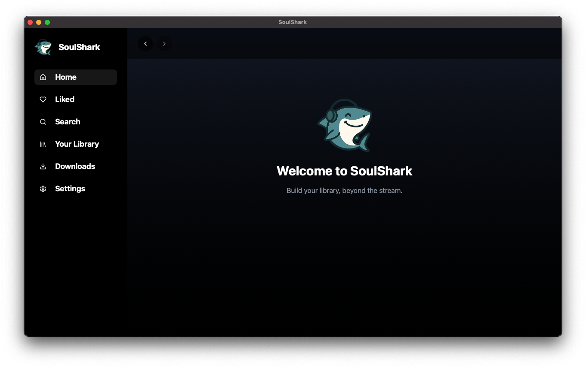
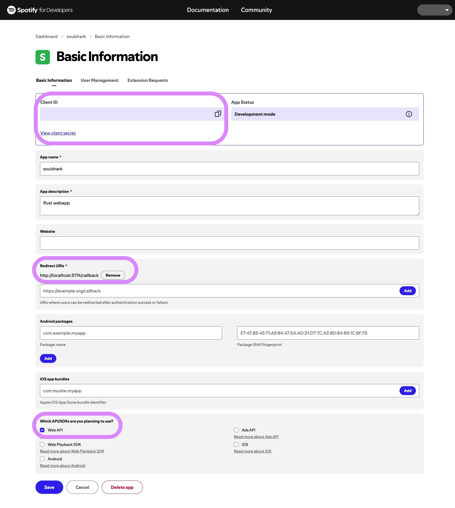
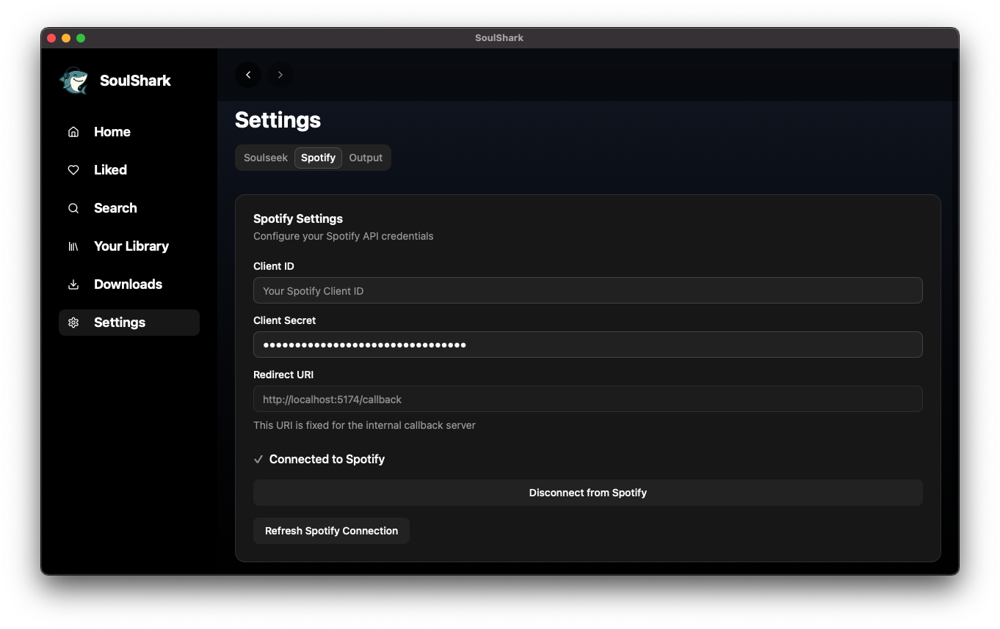
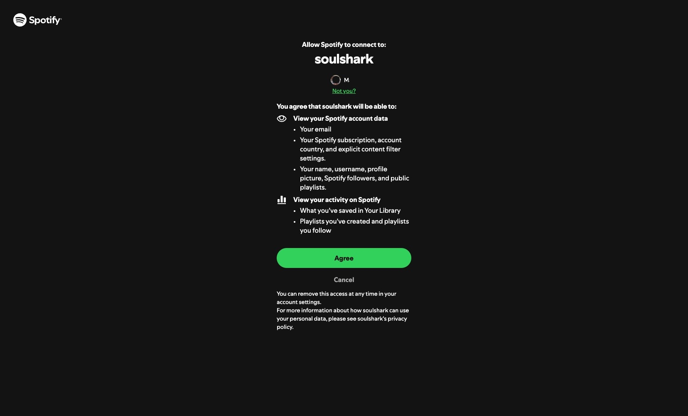
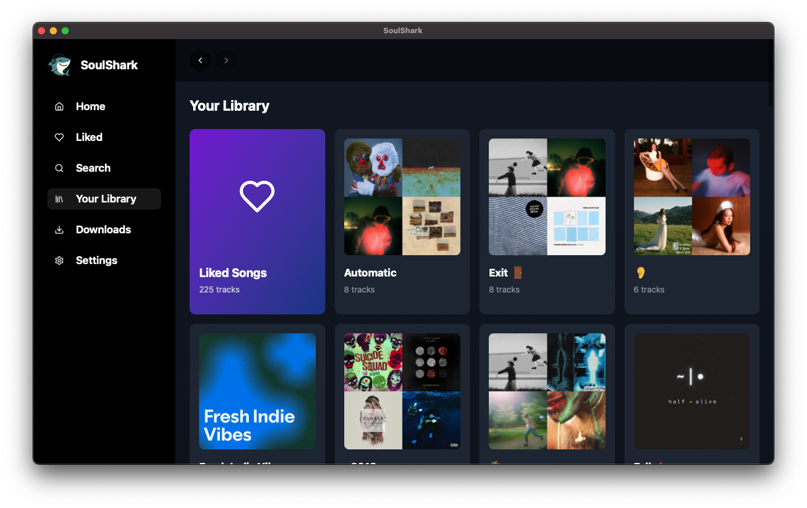
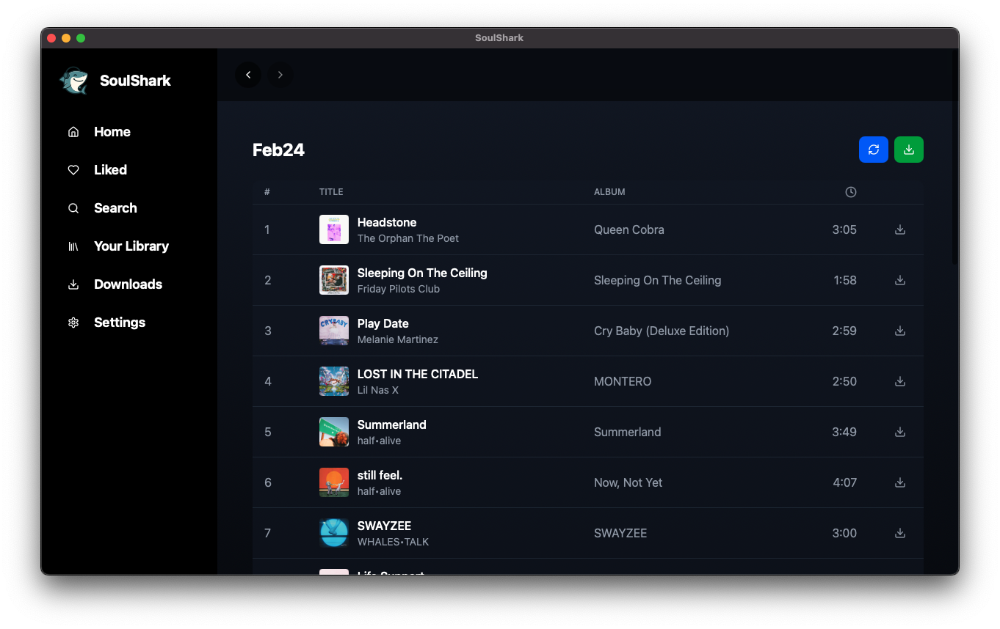
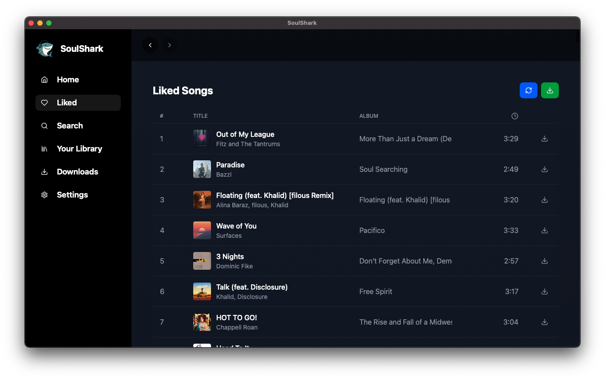
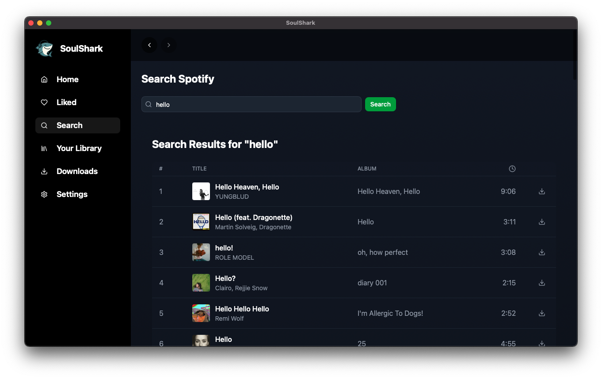
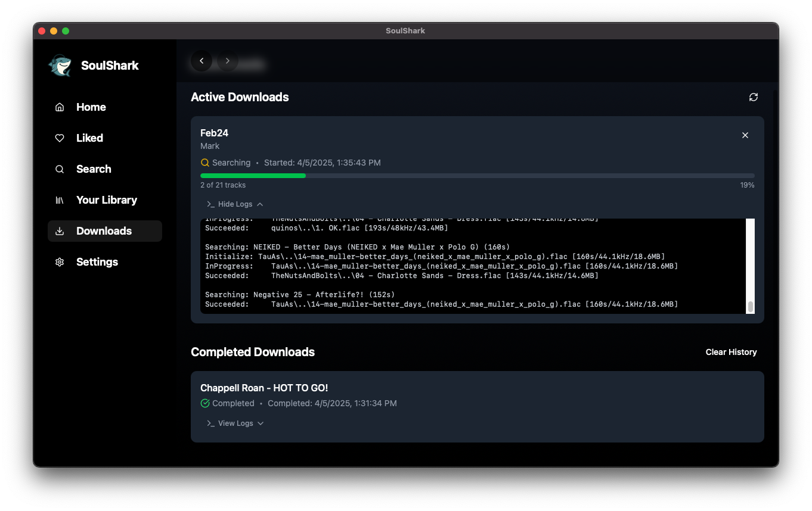

# SoulShark

SoulShark is a macOS desktop application built with Tauri, React, and TypeScript that allows you to locate music on Soulseek, using Spotify for a familiar library and search.



## Getting Started

### Setting Up Spotify Integration

1. Create a Spotify Developer account at [developer.spotify.com](https://developer.spotify.com/)
2. Create a new app in the Spotify Developer Dashboard

   

3. Configure your app with the following settings:
   - Add `http://localhost:5174/callback` as a Redirect URI
   - Select "Web API" under "Which API/SDKs are you planning to use?"
4. Copy your Client ID and Client Secret
5. In SoulShark, go to Settings and enter your Spotify Client ID and Client Secret

   

### Logging In to Spotify

1. Click the "Connect to Spotify" button in the app

   

2. A browser window will open asking you to sign in to your Spotify account
3. Authorize the SoulShark application
4. Close the browser window
5. Your Spotify library will now load in SoulShark

   

### Connecting to Soulseek

In the Soulseek section of Settings:
1. Enter your Soulseek credentials (username/pass) 
2. Enter an absolute path on your machine to store downloads. 
3. Enter your desired file download format without a leading period (i.e. `mp3`, `flac`)

> ⚠️ Do not set `Downloads Path` as your main music library storage, since it performs destructive operations during normal use.

### Using SoulShark

- Browse your Spotify library
  
  

- View your playlists
  
  

- View your liked songs
  
  

- Search for tracks, albums, or artists
  
  

- Download music from Soulseek that matches your Spotify content
  
  

## Development

If you're interested in contributing or building from source:

```bash
# Install dependencies
bun install

# Run development server
bun run tauri dev
```

### Compiling for Your Platform

SoulShark requires a platform-specific binary of the Soulseek downloader. The following steps explain how to compile this binary:

1. Clone the Soulseek downloader repository:
   ```bash
   git clone https://github.com/fiso64/slsk-batchdl
   ```

2. Compile the downloader for your platform:
   
   For macOS (Apple Silicon):
   ```bash
   cd slsk-batchdl
   dotnet publish ./slsk-batchdl.csproj -c Release -r osx-arm64 --self-contained true -p:PublishSingleFile=true -p:UseAppHost=true -o /path/to/webtunes/src-tauri/binaries/sldl_publish
   cp /path/to/webtunes/src-tauri/binaries/sldl_publish/sldl /path/to/webtunes/src-tauri/binaries/sldl-aarch64-apple-darwin
   ```

   For other platforms, adjust the `-r` parameter and output path accordingly:
   - Windows: `-r win-x64` → `sldl-x86_64-pc-windows-msvc.exe`
   - Linux: `-r linux-x64` → `sldl-x86_64-unknown-linux-gnu`
   - macOS (Intel): `-r osx-x64` → `sldl-x86_64-apple-darwin`

3. Build or run SoulShark using the appropriate Tauri commands.

## To Do

- [x] Spotify SDK integration
- [x] Spotify authentication
- [x] Soulseek downloader integration
- [ ] Playlist conversion
- [ ] Github CI Workflow
- [ ] Sign macOS binary
- [ ] Compile for Windows/Linux/macOS Intel
- [ ] Secure encryption keys (better than plaintext though, right?)

## Credits

- [slsk-batchdl](https://github.com/fiso64/slsk-batchdl) - The bundled Soulseek download client
- [soulify](https://github.com/WB2024/soulify) - Inspired the concept of SoulShark (SoulShark is a remake with Rust/Tauri and a modernized UI)

## License

GNU General Public License v3.0